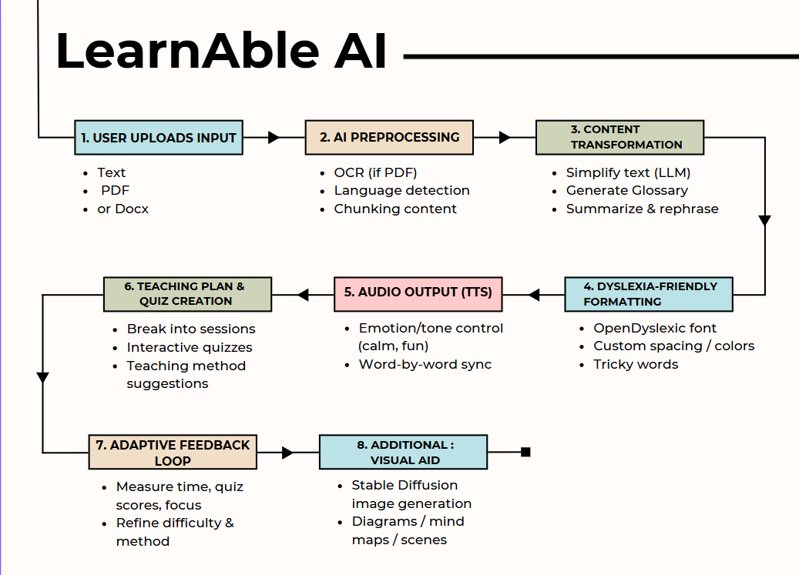

# LearnAble AI – Teaching Copilot for Dyslexia

**LearnAble AI** is an AI-powered learning assistant designed to support individuals with dyslexia by simplifying content, providing audio narration with emotional tone, generating visual aids, and creating personalized lesson plans. It enables an inclusive, multisensory learning experience through reading, listening, visualizing, and interacting — all in one unified platform.

## 🧭 Why It Matters

Over 700 million people globally face reading challenges due to dyslexia. LearnAble AI bridges the cognitive accessibility gap in education through AI. It allows learners to read, listen, visualize, and interact with study material — boosting confidence, inclusion, and academic success.

## 🚀 Features

- ✏️ **Text Simplification** using Gemini for easier comprehension
- 🔊 **Emotion-rich Text-to-Speech** via ElevenLabs
- 📸 **Visual Aid Generation** from Pexels API
- 📄 **PDF/Text Upload** and extraction using PDF2MD
- 📚 **Personalized Lesson Plans & Interactive Quizzes** based on user level

## 💡 Innovation & Uniqueness

- Combines AI-based simplification, emotional voice modulation, and visual support.
- Supports adaptive teaching strategies based on user pace and needs.
- Promotes accessibility through multi-sensory learning experiences.
- Scalable to support other learning disabilities (ADHD, autism).

## 👨‍💻 Tech Stack

- **Frontend and Backend**: React, Tailwind CSS, Vite, TypeScript, ShadCN UI
- **AI Services**:
  - Gemini API – Text simplification
  - ElevenLabs – Text-to-Speech
  - Pexels API – Visuals for conceptual aid
  - PDF2MD – PDF text extraction
    
## 🧠 How It Works

Below is the complete user journey inside LearnAble AI:



1. Upload educational content (PDF/text).
2. The system simplifies the content for dyslexic learners using Gemini.
3. Narration is generated with emotion-aware voice synthesis.
4. Visual aids are fetched to enhance conceptual clarity.
5. Personalized lesson plans and interactive quizzes are generated.

## 📦 Installation & Running Locally

```bash
# 1. Install dependencies
npm install

# 2. Run development server
npm run dev
```
## ⚡Created by Team THUNDERBOLTS 

We are a passionate team of AI engineers, developers, and educators committed to building inclusive learning solutions.

**Members:**
  - Gurinder Singh
  - Bhavya Sharma
  - Dipesh Jaluria
  - Mansimrat


